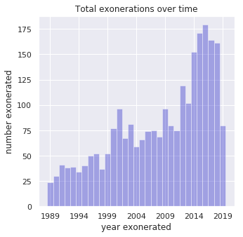
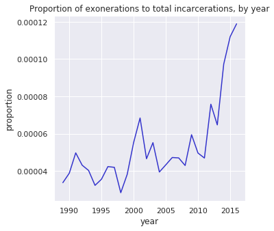
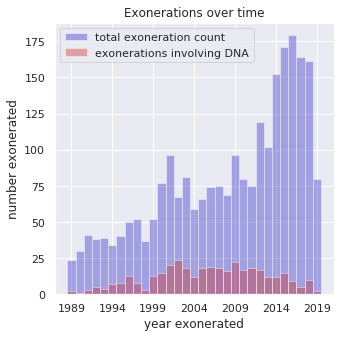
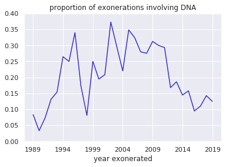
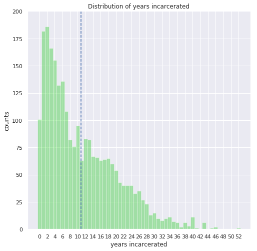

## Exonerations Exploration
(Talk about rise in popularity of documentaries, podcasts, shows about cases of possible wrongful convictions)

See how well our feelings from popular culture are represented by the actual data.

Based on the above musings, some obvious questions to ask are the following:

* Are exonerations becoming more frequent?
* Is DNA evidence playing an increasing role in exonerations? What other factors are involved? (recantations)
* How is race related to incarceration time?
* Are certain crime convictions more likely to be overturned?
* What can be said about the geographical distribution of exonerations?

The data set for this investigation comes from the [National Registry of Exonerations](https://www.law.umich.edu/special/exoneration/), a website devoted to collecting information about overturned convictions in the United States dating back to 1989. A spreadsheet is provided containing an entry for each incident of an exoneration. Each entry comes with several features including dates, crimes, races of offenders, and so on. In particular, features are included which indicate whether DNA was involved in the exoneration, whether erroneous scientific evidence was used, whether official misconduct was used, and more.

Let us say what the data can tell us. This will be largely an exploratory data analysis (EDA), in which we use visualizations and summary statistics to make observations.

*Note that I often equate exoneration with wrongful conviction, which I am not sure is the same thing. That is, I believe persons can be exonerated without demonstration of innocence. Please forgive my naivete in these legal matters.*

### Exonerations over time
One interesting variable we can look at quickly is *year_exonerated*, which indicates the year in which the conviction was overturned. We expect that the number of exonerations will increase with year; improved technology (including DNA) may be used to prove innocences, and increased public pressure on law enforcement/legal people may result from an increased access to information about these criminal cases, thanks to the advent of the ubiquitous internet. The histogram of exonerations by year is shown below.

This histogram displays a clear upward trend. However, we are looking at raw counts, and these may be distorted; for example, an increasing number of prisoners over time could account for this apparent uptick in exonerations. We should instead look at the relative number of exonerations per total number of incarcerated persons:
$$ f\left(z\right) = \frac{\text{# exonerations in year } z}{\text{total # of prisoners in year } z} $$

We can quickly obtain a rough count of the total number of persons in prison by year from the [Bureau of Justice Statistics](https://www.bjs.gov/index.cfm?ty=kfdetail&iid=487). This source contains estimated numbers from 1980 through 2016, and so we will ignore the years preceeding 1989 and following 2016. For this range of years, we can "normalize" the above graph by dividing each bin by the estimated number of prisoners to obtain a fraction of incarcerations which were overturned. In this way, we can directly compare the different years. Below is the trend of these proportions.

This plot (along with the previous one) indicate an upward trend in both the absolute number of exonerations per year as well as the relative proportion of exonerations out of all possible incarcerated persons. Note the scale on the proportions in the latter plot: the likelihood of an arbitrary prisoner being exonerated in 2016 --- the year with the highest such likelihood --- was only about one-hundredth of a percent.

### Use of DNA
Now that we have seen that exonerations are generally on the increase, let's investigate our guess that DNA evidence plays an increasing role in these exonerations. The data provides a flag indicating which cases included DNA evidence and, of these, which exonerations relied heavily on the use of DNA evidence. 

The histogram above, similar to the first histogram of exonerations by year, includes a second histogram indicating the number of exonerations involving DNA evidence each year. The shape and height of this histogram is a bit shocking, since it seems to contradict my original guess that DNA evidence would play an ever-increasing, important role in exonerations. In fact, the proportion of cases involving exonerating DNA evidence each year seems small, and even appears to decrease over time! We can look directly at this proportion (the ratios of the heights of the red bars to those of the blue bars, above): 

Indeed, there is a clear downward trend in this proportion after about 2005, and so my impression of the overwhelming importance of DNA for exonerations seems wrong. So, with this in mind --- what else could account for these overturned convictions?

### Other Factors
The dataset contains several other tags and features which 

### Incarceration time, race
The idea of being wrongfully imprisoned for any amount of time is disturbing, but it is especially harrowing to hear stories about people being locked away for decades of their lives. How often do these long-term wrongful imprisonments occur? More generally, let's look at the distribution of incarceration times.

The dataset provides conviction years as well as exoneration years for each case, and so we compute the incarceration time duration as the difference of these two variables. The histogram for these incarceration times is shown in the below figure:

The downward trend in this histogram is encouraging in that it indicates that longer wrongful incarcerations are less likely than shorter ones. Despite this, the average incarceration time is just about 11 years, a significant portion of a human lifetime. 

We can obtain a probability distribution over the length of wrongful imprisonment term by normalizing the above histogram. Notice that the shape of the distribution is reminiscent of an exponential distribution. For fun, we can fit an exponential distribution to this data. The exponential distribution is of the form 
$$ p\left(t; \, \lambda\right) = \lambda \exp \left( -\lambda t\right) $$
where $\lambda$ is the parameter of the distribution. The maximum likelihood estimator of this parameter is quite easily shown with calculus to be equal to the inverse of the sample mean:
$$ \lambda^{-1} = \frac{1}{n}\sum_{i=1}^n t^{\left(i\right)} $$

### Geography of exonerations

